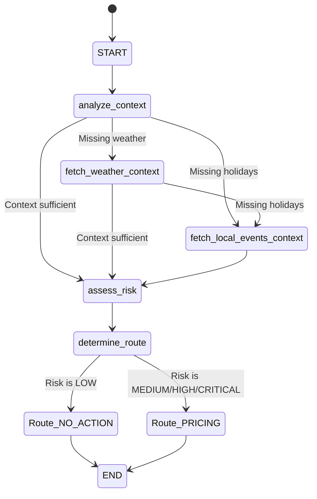
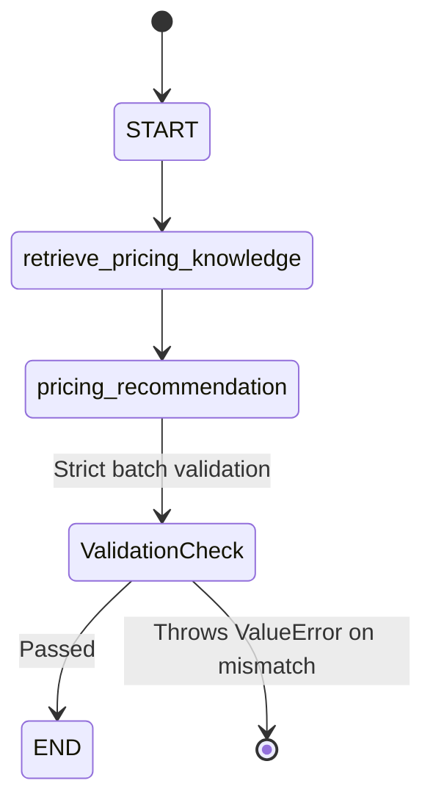

# AI Service System Context Specification: FoodLoop AI Microservice

This document serves as the single source of truth and technical specification for the standalone FoodLoop AI Microservice. It describes the framework, agentic workflows, RAG subsystems, API contracts, vector storage configurations, and system configurations.

---

## 1. Service Overview & Tech Stack

### Framework & Runtime
*   **Language & Runtime:** Python (compatible with >= 3.10; verified on Python 3.14.6)
*   **Web Framework:** FastAPI, Uvicorn (ASGI server)
*   **Serialization & Validation:** Pydantic v2 (`BaseModel`, `Field`, `model_validator`)

### Agentic & LLM Frameworks
*   **Orchestration Engine:** LangGraph (`StateGraph`), LangChain (`ChatPromptTemplate`)
*   **LLM Provider Client:** OpenAI-compatible client (configured to use SambaNova API access)
*   **Inference Model:** Gemma 2 27B IT / Gemma 3 27B IT
*   **Structured Parsing:** Native LangChain `.with_structured_output` using Pydantic schemas.

### Vector Database & Embeddings
*   **Vector Database:** Qdrant Client (supports memory-mode fallback for testing/MVP)
*   **Embedding Model:** `BAAI/bge-m3` (local provider `local_bge_m3`)
*   **Vector Dimensions:** 1024-dimensional vectors
*   **Distance Metric:** Cosine similarity (`rest_models.Distance.COSINE`)

### Project Structure
```
c:\ITI\AI_Service\
├── app/
│   ├── agents/                     # LangGraph workflows and agent systems
│   │   ├── monitoring/             # Inventory Monitoring Agent (context, risk, routing)
│   │   └── pricing/                # Pricing Recommendation Agent (RAG retrieval, batch decisions)
│   ├── api/                        # FastAPI route handlers and controllers
│   │   └── routes/                 # Endpoint routing (health, monitoring, pricing)
│   ├── cli/                        # CLI administration scripts (smoke checks)
│   ├── config/                     # Settings models and production validation logic
│   ├── embeddings/                 # Embedding provider factory and model adapters
│   ├── llm/                        # Chat LLM factory and client adapters
│   ├── middleware/                 # ASGI middleware (correlation IDs)
│   ├── policies/                   # Operating automation mode policies
│   ├── schemas/                    # Pydantic v2 input/output contract schemas
│   ├── services/                   # Business services (RAG data ingestion)
│   ├── tools/                      # External tool adapters (weather, holidays)
│   ├── vector_store/               # Vector DB abstract interface and Qdrant implementation
│   └── main.py                     # App entry point, exception handlers, and middlewares
├── tests/                          # Automated Pytest suite (unit, integration, and live tests)
├── pyproject.toml                  # Project metadata, dependencies, and build configurations
└── .env                            # Environment variables config
```

---

## 2. Agent Architecture & Workflows

### Monitoring Agent Workflow
The Monitoring Agent evaluates a single product inventory situation to determine whether pricing action or no action is required.

#### Graph Execution Steps:
1.  **State Initialization**: Receives `MonitoringRequest` containing product metadata, inventory, demand, expiry, and location metrics.
2.  **Context Analysis**: LLM evaluates context sufficiency. If weather or holiday context is materially missing, routes to tool nodes.
3.  **Fetch Weather Context (Optional)**: Calls Open-Meteo API for forecast over the product's remaining shelf-life.
4.  **Fetch Local Events Context (Optional)**: Calls Nager.Date API for national public holidays.
5.  **Assess Risk**: LLM classifies risk (`LOW`, `MEDIUM`, `HIGH`, `CRITICAL`) using deterministic signals and retrieved contexts.
6.  **Route Determination**: Classifies final API routing. If risk is `LOW`, route is `NO_ACTION`; otherwise, route is `PRICING`.



---

### Pricing Recommendation Agent Workflow
The Pricing Agent evaluates batch requests from a store to generate discount percentages for one or more products concurrently.

#### Graph Execution Steps:
1.  **Batch Intake**: Receives `PricingBatchRequest` (max 50 products per batch).
2.  **Retrieve Pricing Knowledge**: Embedding model embeds product contexts; Vector Store performs store-isolated similarity queries.
3.  **Pricing Recommendation**: LLM evaluates metrics, signals, and RAG knowledge to recommend a discount percentage (`0%` to `15%`).
4.  **Strict Batch Validation**: Verifies that every input product maps exactly to one output pricing decision with no duplicates or missing IDs.



---

### Historical Ingestion & RAG Subsystem
*   **Ingestion Pipeline**: The backend .NET server pushes completed pricing episodes containing sales outcome data to the `/knowledge/ingest` endpoint.
*   **Vector Compilation**: Episodes are parsed into structured textual documents representing the historical scenario and embedded into a 1024-dimensional space.
*   **RAG Retrieval**: Product queries embed current state context and search Qdrant filtered by `store_id` (strict isolation) and optional category filters, returning top-$k$ historical references.

---

## 3. Pydantic Schemas & Serialization Contracts

### Inventory Monitoring Schemas
```python
class Route(str, Enum):
    PRICING = "PRICING"
    NO_ACTION = "NO_ACTION"

class RiskLevel(str, Enum):
    LOW = "LOW"
    MEDIUM = "MEDIUM"
    HIGH = "HIGH"
    CRITICAL = "CRITICAL"

class ProductMetadata(BaseModel):
    id: str
    name: str
    category: str

class InventoryMetrics(BaseModel):
    quantity: int = Field(..., ge=0)
    original_price: float = Field(..., ge=0.0)
    current_price: float = Field(..., ge=0.0)
    price_floor: float = Field(..., ge=0.0)

class HistoricalSales(BaseModel):
    average_daily_sales: float = Field(..., ge=0.0)
    weekday_average: float | None = Field(default=None, ge=0.0)
    weekend_average: float | None = Field(default=None, ge=0.0)

class DemandContext(BaseModel):
    sales_velocity: float = Field(..., ge=0.0)
    historical_sales: HistoricalSales

class ExpiryContext(BaseModel):
    expires_at: datetime
    hours_remaining: float = Field(..., ge=0.0)

class LocationContext(BaseModel):
    latitude: float
    longitude: float
    store_id: str

class MonitoringRequest(BaseModel):
    product: ProductMetadata
    inventory: InventoryMetrics
    demand: DemandContext
    expiry: ExpiryContext
    location: LocationContext
    timestamp: datetime
    store_policy: StorePolicy | None = Field(default=None)

class MonitoringResponse(BaseModel):
    route: Route
    risk_level: RiskLevel
    reason: str
    confidence: float = Field(..., ge=0.0, le=1.0)
```

### Pricing Batch Recommendation Schemas
```python
class PricingProductContext(BaseModel):
    product_id: str = Field(..., min_length=1)
    product_name: str | None = Field(default=None)
    category: str | None = Field(default=None)
    inventory: InventoryMetrics
    demand: DemandContext
    expiry: ExpiryContext
    risk_assessment: RiskAssessmentResult
    weather_context: WeatherContext | None = Field(default=None, alias="weather")
    events_context: LocalEventsContext | None = Field(default=None, alias="local_events_context")

class PricingBatchRequest(BaseModel):
    store_id: str = Field(..., min_length=1)
    store_policy: StorePolicy | None = Field(default=None)
    products: list[PricingProductContext] = Field(..., min_length=1)

class PricingDecision(BaseModel):
    product_id: str = Field(..., min_length=1)
    discount_percentage: float = Field(..., ge=0.0, le=15.0)
    reason: str = Field(..., min_length=1)
    confidence: float = Field(..., ge=0.0, le=1.0)
    action_requirement: ActionRequirement | None = Field(default=None)
    action_reason: str | None = Field(default=None)

class PricingBatchResponse(BaseModel):
    store_id: str = Field(..., min_length=1)
    decisions: list[PricingDecision] = Field(..., description="List of pricing decisions matching each input product.")
```

### Historical Ingestion Schemas
```python
class Outcome(str, Enum):
    SOLD_OUT = "SOLD_OUT"
    PARTIALLY_SOLD = "PARTIALLY_SOLD"
    UNSOLD = "UNSOLD"
    EXPIRED = "EXPIRED"

class HistoricalPricingEvent(BaseModel):
    event_id: str = Field(..., min_length=1)
    store_id: str = Field(..., min_length=1)
    product_id: str = Field(..., min_length=1)
    category: str = Field(..., min_length=1)
    recorded_at: datetime
    quantity: float = Field(..., ge=0.0)
    current_price: float = Field(..., ge=0.0)
    original_price: float = Field(..., ge=0.0)
    price_floor: float = Field(..., ge=0.0)
    sales_velocity: float = Field(..., ge=0.0)
    historical_average_daily_sales: float = Field(..., ge=0.0)
    hours_remaining: float = Field(..., ge=0.0)
    discount_percentage: float = Field(..., ge=0.0, le=15.0)
    units_sold_after_discount: float = Field(..., ge=0.0)
    sell_through_rate: float = Field(..., ge=0.0, le=1.0)
    outcome: Outcome

class HistoricalPricingIngestionRequest(BaseModel):
    events: list[HistoricalPricingEvent] = Field(..., description="Batch of historical pricing events to ingest.")

class HistoricalPricingIngestionResponse(BaseModel):
    accepted_count: int = Field(..., ge=0)
    upserted_count: int = Field(..., ge=0)
    failed_count: int = Field(..., ge=0)
    document_ids: list[str] = Field(default_factory=list)
```

---

## 4. Complete API Routing & Endpoint Catalog

The service exposes the following API controllers:

| HTTP Verb | Route Path | Purpose | Request Schema | Response Schema | Status Codes |
| :--- | :--- | :--- | :--- | :--- | :--- |
| **GET** | `/health` | Process liveness check | None | `{"status": "ok"}` | 200 |
| **GET** | `/ready` | Service readiness dependency check | None | `{"status": "ready", ...}` | 200, 503 |
| **GET** | `/version` | Service version information | None | `{"app_name": "...", ...}` | 200 |
| **POST** | `/api/v1/monitoring/analyze` | Run Inventory Monitoring Graph | `MonitoringRequest` | `MonitoringResponse` | 200, 400, 422, 500 |
| **POST** | `/api/v1/pricing/recommend` | Run batch pricing recommendation | `PricingBatchRequest` | `PricingBatchResponse` | 200, 400, 422, 500 |
| **POST** | `/api/v1/pricing/knowledge/ingest`| Ingest pricing history events | `HistoricalPricingIngestionRequest` | `HistoricalPricingIngestionResponse` | 200, 400, 422, 500 |

### HTTP 422 Unprocessable Entity Response Contract
Pydantic validation errors caught by FastAPI return:
```json
{
  "error": "validation_error",
  "message": "1 validation error for MonitoringRequest\nproduct -> id\n  Field required [type=missing, input_value={}, input_type=dict]"
}
```

---

## 5. Vector Store & RAG Storage Specifications

*   **Collection Name:** `foodloop_pricing_knowledge_bge_m3`
*   **Vector Size:** 1024 dimensions (based on the `BAAI/bge-m3` embedding model)
*   **Distance Metric:** Cosine similarity (`rest_models.Distance.COSINE`)
*   **Indexing Fields:** keyword indices configured on `store_id`, `product_id`, and `category`.
*   **Payload Schema:**
    *   `document_id` (`str`): Unique deterministic document ID (mapped to point UUID via `uuid5`).
    *   `store_id` (`str`): ID of the store (strict isolation key).
    *   `product_id` (`str`): ID of the product.
    *   `category` (`str`): Product category name.
    *   `content` (`str`): Main text chunk representing historical scenario context.
    *   `metadata` (`dict`): Miscellaneous operational snapshots.

---

## 6. Prompt Engineering & Deterministic Guardrails

### Prompt Templates
*   **Monitoring Context Sufficiency Prompt**: Directs the LLM to inspect provided fields and request weather/holidays context ONLY when materially required.
*   **Monitoring Risk Assessment Prompt**: Guides the LLM to classify risk based on current shelf life and demand pressure.
*   **Pricing Recommendation Prompt**: Formats a batch containing products and their associated local weather forecasts, local national holidays, and matched RAG historical items.

### Deterministic Guardrails
*   **Range Constraining**: Pydantic schemas enforce that all output discount recommendations satisfy:
    $$\text{DiscountPercentage} \in [0.0, 15.0]$$
*   **Exact ID Mapping**: Output validation inside `pricing_recommendation` node throws a `ValueError` if the LLM fails to output exactly one decision per input product, prevents duplicates, and prohibits recommending discounts for unknown product IDs.

---

## 7. Configuration & Environment Variables (.env)

The following parameters configure the settings model:

*   `OPENAI_API_KEY`: Authentication token for Groq / SambaNova / Google Gemini or OpenAI inference.
*   `OPENAI_BASE_URL`: API gateway endpoint (`https://api.groq.com/openai/v1`, `https://generativelanguage.googleapis.com/v1beta/openai` or `https://api.sambanova.ai/v1`).
*   `OPENAI_MODEL`: LLM identifier (`openai/gpt-oss-120b`, `gemini-2.5-flash` or `Meta-Llama-3.3-70B-Instruct`).
*   `EMBEDDING_PROVIDER`: Selected embedding method (`local_bge_m3` or `openai`).
*   `VECTOR_STORE_PROVIDER`: Storage engine provider (`memory` or `qdrant`).
*   `QDRANT_URL`: Vector database host endpoint (`http://localhost:6333`).
*   `QDRANT_COLLECTION_NAME`: Collection namespace (`foodloop_pricing_knowledge_bge_m3`).
*   `MAX_PRICING_BATCH_SIZE`: Maximum items per batch request (default 50).
*   `HISTORICAL_INGESTION_MAX_BATCH_SIZE`: Maximum events per ingestion request (default 100).
*   `WEATHER_PROVIDER`: Weather fetch implementation (`open_meteo` or `mock`).
*   `EVENTS_PROVIDER`: Public holidays fetch implementation (`nager_date` or `mock`).

---

## 8. Test Suite & Verification Matrix

*   **Test Layout**: Standard Pytest structure under `tests/` directory with units covering schema validations, agent state graphs execution, controller routing, mock service implementations, and Qdrant integration.
*   **Execution Command**:
    `python -m pytest`
*   **Verification Status**: All **291 tests passed** (7 tests skipped under mock setups).
